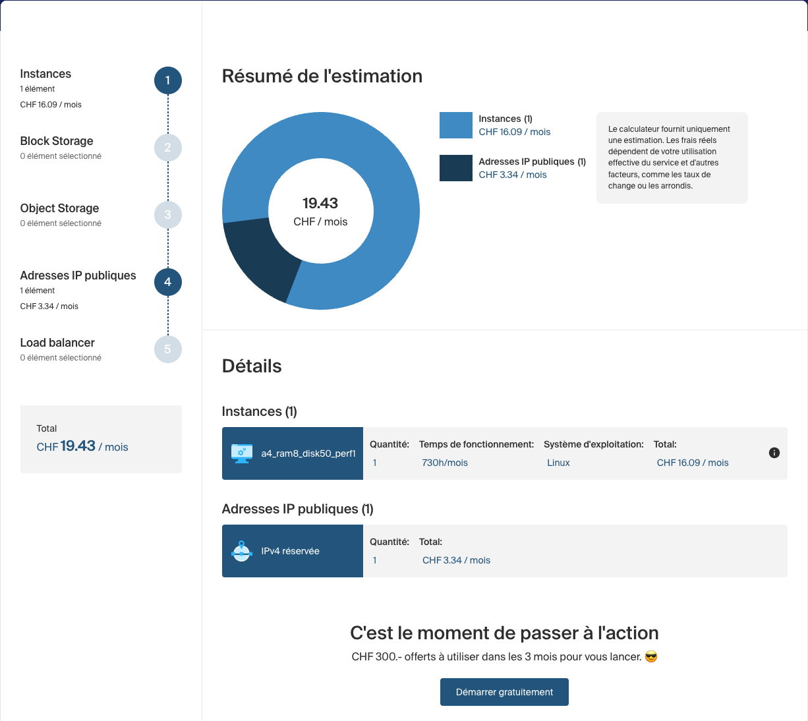

# ADR-0035: Infomaniak Public Cloud for Production Hosting

## Status

Accepted

## Context

Block 8 (Production Deployment) requires choosing the hosting provider for
the production environment. The roadmap had deferred the decision to "Hetzner
Cloud or Infomaniak, decided when the block starts". Preparing Block 8
surfaced the decision, with an additional requirement stated by the author:

- **Data residency**: real personal financial data (bank transactions
  imported from camt.053 files) must not leave Switzerland. This is a
  personal sovereignty requirement, aligned with the nLPD posture of the
  project, and it is a *hosting-location* requirement — anonymization was
  examined and rejected (see Alternatives).
- **Infrastructure as Code**: the provider must be manageable with
  Terraform-compatible tooling (see ADR-0036).
- **Cost**: the application serves a single real user; the budget target is
  "economical VPS", roughly CHF 10–20/month.
- **Stack footprint**: the production Docker Compose stack runs two JVMs
  (Spring Boot API, Keycloak), PostgreSQL, and a reverse proxy. Realistic
  memory budget is ~2.5–3.5 GB, which sizes the VM at 4 vCPU / 8 GB RAM /
  50 GB disk for comfortable headroom.

Providers evaluated (July 2026 pricing; figures other than Infomaniak's
come from aggregated sources and are indicative). The Infomaniak line was
confirmed in the official calculator on 2026-08-29 — see
[Confirmed pricing](#confirmed-pricing-2026-08-29) below:

| Provider | 4 vCPU / 8 GB tier | IaC path | Swiss jurisdiction |
|---|---|---|---|
| Hetzner (DE) | ~€8/month | first-party `hcloud` provider | no |
| Infomaniak Public Cloud (CH) | **CHF 19.43/month** confirmed (`a4-ram8-disk50-perf1` + reserved IPv4) | OpenStack provider (+ official provider for KaaS/DBaaS/DNS) | yes |
| Exoscale (CH) | ~$67/month + storage | first-party provider, Pulumi | yes |
| Azure Switzerland North | ~$45–60+/month all-in | `azurerm` (best-in-class) | datacenter only (US CLOUD Act applies) |

## Decision

Production hosting runs on **Infomaniak Public Cloud** (OpenStack-based,
`ch-gva` region), on a single **`a4-ram8-disk50-perf1`** instance
(4 vCPU / 8 GB RAM / 50 GB local disk, 10 TB egress included) plus one
reserved IPv4 address — **CHF 19.43/month excl. VAT**, provisioned with
OpenTofu through the OpenStack Terraform provider (ADR-0036).

Two companion decisions frame the deployment:

1. **Availability doctrine: recoverability over availability.** Every
   component of the single-VM deployment is a single point of failure, and
   this is *accepted*. At single-user scale, the cost of high availability
   (multi-VM, load balancer, replicated PostgreSQL) buys nothing the user
   needs. The engineering effort goes into **recoverability** instead:
   - **RPO 24 h**: daily encrypted off-site PostgreSQL backup (Block 8
     deliverable); transactions are re-importable from e-banking anyway.
   - **RTO < 1 h**: the VM is fully reconstructible from the repository
     (OpenTofu code + SOPS-encrypted secrets, ADR-0037) plus the latest
     backup. A documented, *tested* restore procedure is part of Block 8.
2. **Demo isolation via multi-tenancy.** The public instance hosts the
   author's real data behind their own login. Recruiters/visitors get a
   `demo` user seeded with fictional data on the same instance. The
   multi-tenant architecture (ADR-0014) and the ownership-check pattern
   provide the isolation; no second environment is run.

Azure (Switzerland North) is **not** used for persistent hosting, but is
retained as an **ephemeral interview demo** target: the Helm charts built
for the k3d demo (ADR-0010, Block 10) can be applied to a short-lived AKS
cluster (created before an interview, destroyed after, hourly billing,
fictional data only). This extends ADR-0010 rather than replacing it.

## Confirmed pricing (2026-08-29)

The July figures were EUR estimates from third-party aggregators. The
official calculator was consulted on 2026-08-29 for a Swiss customer,
with block storage, object storage and load balancer all left empty —
the deployment needs none of them, because the 50 GB disk is part of the
flavor:

| Line | Monthly (excl. VAT) |
|---|---|
| `a4_ram8_disk50_perf1`, 730 h, Linux | CHF 16.09 |
| Reserved IPv4 address | CHF 3.34 |
| Block storage / object storage / load balancer | — (none) |
| **Total** | **CHF 19.43** |

Two corrections to the July analysis follow from this:

- **The estimate was low by roughly 50 %.** ~€14.50/month became CHF 19.43
  (~€21.60 at the ICU rate below). The gap is almost entirely the reserved
  IPv4 address, which no aggregator listed and which the July analysis had
  flagged as an open item: at CHF 3.34 it is 21 % of the instance price,
  not a rounding error.
- **The decision is unaffected.** The comparison that settled this ADR was
  Infomaniak against Exoscale (~$67) and Azure (~$45–60); CHF 19.43 leaves
  that ranking intact, and the figure still sits inside the CHF 10–20
  budget target stated in the Context.

Billing details confirmed alongside the price
([Infomaniak billing FAQ](https://www.infomaniak.com/en/support/faq/2605/understanding-public-cloud-billing),
[docs.infomaniak.cloud](https://docs.infomaniak.cloud/metering/billing/)):

- Billing is accounted in **ICU** (Infomaniak Cloud Unit): 1 ICU = CHF 50
  = EUR 55.50. Displayed prices **exclude VAT**.
- The **public IPv4 is billed even while the instance is stopped**, as is
  storage — powering the VM down does not suspend the bill.
- Any started hour counts as a full hour; Public Cloud invoices are
  **payable by credit card only**.
- `perf2` flavors (1000 IOPS / 400 MB/s versus perf1's 500 / 200) exist
  but are **enabled on request only** — `perf1` is the right default, not
  merely the cheaper option.
- The **CHF 300 free credit over 3 months** covers more than fifteen
  months at this rate, so the entire Block 8 build-out — including
  destroying and recreating the infrastructure freely while learning
  OpenTofu — costs nothing.

## Consequences

### Positive

- Real financial data stays in Switzerland under Swiss jurisdiction,
  consistent with the project's nLPD/security narrative.
- CHF 19.43/month fits the CHF 10–20 budget target; the CHF 300 free
  credit (3 months) covers the entire Block 8 build-out.
- 8 GB RAM gives comfortable headroom over the ~3 GB stack, including
  deployments and camt.053 parsing spikes; moving to the 16 GB tier is a
  modest upgrade if Block 9 observability needs it (~€4/month by the July
  estimates — not re-verified in the calculator, unlike the figures above).
- The OpenStack resource model (instance, security groups, floating IP as
  explicit objects) teaches the same explicit network topology used by
  Azure/AWS/GCP — direct preparation for the ephemeral AKS demo.
- The accepted-SPOF/recoverability doctrine, documented with RPO/RTO, is a
  deliberate scale-calibration decision (stronger interview material than
  cargo-cult high availability).

### Negative

- ~2.5× the price of the equivalent Hetzner instance once the reserved
  IPv4 is counted — the cost of the data residency requirement.
- The OpenStack Terraform provider is more verbose and less polished than
  first-party providers (`hcloud`, Exoscale); error messages surface in
  OpenStack vocabulary. Estimated overhead: a few hours across Block 8.
- The official Infomaniak Terraform provider covers only KaaS, DBaaS, and
  DNS — compute goes through the generic OpenStack provider.
- Restore procedure must actually be tested for the RTO claim to hold;
  an untested backup is not a backup.

### Neutral

- Flavors with `disk0` require boot-from-volume; the chosen
  `diskXX-perf1` flavors avoid volume management entirely. The
  counterpart is that the 50 GB disk shares the instance's lifecycle:
  anything that forces the instance to be replaced destroys PostgreSQL
  with it. Consistent with the RPO 24 h doctrine above, but it makes
  `prevent_destroy` (or equivalent vigilance on every `tofu plan`) a
  Block 8 requirement rather than a nicety.
- Infomaniak KaaS (managed Kubernetes, covered by the official provider)
  is a possible Swiss alternative or complement to the AKS ephemeral demo
  at Block 10; nothing is decided now.

## Alternatives Considered

### Hetzner Cloud

Best price/performance in Europe (~€8/month for the target tier) and the
cleanest first-party Terraform provider. Rejected on the data residency
requirement alone: German/EU jurisdiction and datacenters. Would be the
choice for any environment that carries no real data (e.g., a disposable
staging environment).

### Exoscale

Swiss jurisdiction, first-party Terraform provider, official Pulumi
support, SKS managed Kubernetes. Rejected on cost: ~4–5× Infomaniak for
the same tier (~$67/month + storage billed separately), while its
differentiators (polished provider, SKS) are not needed — Kubernetes
demos are covered by k3d/AKS, and the OpenStack provider verbosity is an
acceptable, even useful, learning cost.

### Azure Switzerland North (persistent hosting)

Swiss datacenters and the most CV-relevant ecosystem for the target
employers (UBS is a flagship Azure customer). Rejected for persistent
hosting on two grounds: cost (~CHF 45–60+/month all-in, ~4× Infomaniak)
and the jurisdiction nuance — data resides in Zurich but Microsoft remains
subject to the US CLOUD Act, so the setup would not honestly serve the
"Swiss sovereignty" narrative. Retained as an ephemeral, hourly-billed
interview demo with fictional data only.

### Anonymizing data on a cheaper non-Swiss host

Anonymization solves "showing data to third parties", not "where data
lives". Pecunia is the author's daily budgeting tool: anonymized amounts,
dates, and counterparties would destroy the application's utility, and
financial transactions are notoriously hard to anonymize (amounts + dates
+ merchant labels are quasi-identifiers). Encryption at rest does not
change jurisdiction either, since data is processed in clear on the VM.
Rejected; anonymization remains scoped to `samples/` and demo-user data.

## References

- Infomaniak Public Cloud: https://www.infomaniak.com/en/hosting/public-cloud
- Infomaniak Terraform documentation: https://docs.infomaniak.cloud/orchestration/terraform/
- Official Infomaniak Terraform provider (KaaS/DBaaS/DNS only):
  https://github.com/Infomaniak/terraform-provider-infomaniak
- Hetzner vs Infomaniak comparison: https://www.vpsbenchmarks.com/compare/hetzner_vs_infomaniak
- Exoscale pricing: https://www.exoscale.com/pricing/
- ADR-0010 (k3d instead of AWS for demo), ADR-0014 (multi-tenant
  architecture), ADR-0036 (OpenTofu), ADR-0037 (secrets management)
