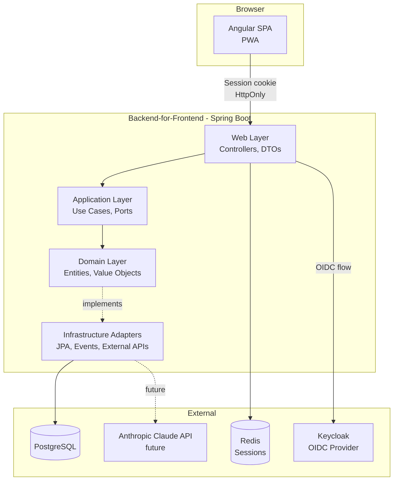
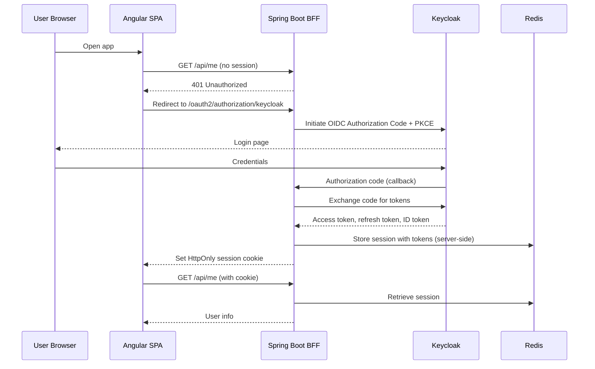
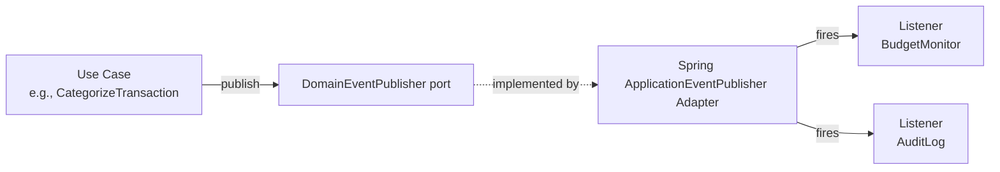

# Architecture

This document describes the technical architecture of Pecunia. It is the
primary reference for engineers exploring the codebase and the canonical
explanation of design choices.

For the rationale behind specific decisions, see the corresponding
[Architecture Decision Records](adr/).

## Guiding Principles

Pecunia is built around five principles, applied consistently across the
codebase.

### 1. Domain at the center

Business logic is independent of frameworks, databases, HTTP, and UI. The
domain layer knows nothing about Spring, Hibernate, or Angular. This is the
foundation of **Hexagonal Architecture** (also known as Ports and Adapters).

### 2. Explicit boundaries

The codebase is a **modular monolith**: a single deployable unit internally
organized as bounded contexts with clear interfaces. Modules communicate
through well-defined APIs (in-process for now, potentially over the network
later).

### 3. Schema-first contracts

The HTTP API is defined in `contracts/openapi.yaml` before any code is
written. Backend controllers and frontend clients are generated from this
contract. The OpenAPI specification is the single source of truth.

### 4. Security by default

Every endpoint is authenticated and authorized by default. Sensitive data is
encrypted in transit and sanitized in logs. The architecture enforces
ownership: a user can only access their own data, with checks at the
application layer.

### 5. Typed results, not exceptions for expected outcomes

Business outcomes that may "fail" in expected ways (e.g., import failure due
to a malformed file) are modeled with sealed interfaces and record
implementations, not exceptions. Exceptions are reserved for truly exceptional
situations.

## High-Level Architecture



The browser communicates with the Spring Boot backend exclusively through
session cookies. No tokens leak to the frontend. The backend acts as a
Backend-for-Frontend (BFF), handling the OIDC flow with Keycloak and managing
all token storage server-side.

## Layered Architecture (Hexagonal)

The backend is structured in four logical layers, organized following
Hexagonal Architecture (Ports & Adapters).

### Domain layer

The center of the application. Contains:

- **Entities**: business objects with identity (e.g., `Account`, `Transaction`).
- **Value objects**: immutable types without identity (e.g., `Money`,
  `IbanNumber`, `CategoryPath`).
- **Aggregates**: consistency boundaries (e.g., `Account` is the aggregate
  root for its `Transactions`).
- **Domain events**: facts about something that happened
  (e.g., `TransactionCategorized`, `BudgetThresholdReached`).

The domain layer holds **no port interfaces** — ports live in the application
layer (see [ADR-0026](adr/0026-ports-in-application-layer.md)). It has **no
dependency on Spring, JPA, or any infrastructure concern**. It is pure Java.

### Application layer

Orchestrates use cases by coordinating domain objects and ports, and **owns
all ports** (see [ADR-0026](adr/0026-ports-in-application-layer.md)). Use cases
are the application's API surface for the outside world (called by controllers
or background workers).

- **Driving ports** (`port.in`): one interface per use case, named after the
  action (e.g., `ImportCamt053Statement`, `CategorizeTransaction`,
  `ComputeMonthlyDashboard`), implemented by a service in `application.service`.
  Controllers depend on the interface, not the service.
- **Driven ports** (`port.out`): the SPI the application needs from the
  outside (e.g., `AccountRepository`, `DomainEventPublisher`), implemented by
  adapters in the infrastructure layer.
- **Transaction boundaries**: typically defined at this layer
  (`@Transactional`).
- **Mapping**: between domain types and DTOs happens at this boundary.

### Web layer (driving adapter)

Translates HTTP requests into use case calls.

- **Controllers**: thin classes that implement the OpenAPI-generated
  interfaces, validate input via Bean Validation, and delegate to use cases.
- **DTOs**: generated from `contracts/openapi.yaml`.
- **Security**: Spring Security filters handle authentication and CSRF
  protection. Method-level `@PreAuthorize` checks enforce authorization.
- **Error mapping**: typed business results are mapped to HTTP responses.

### Infrastructure layer (driven adapters)

Implements the driven ports (`port.out`) defined by the application layer.

- **Persistence adapters**: JPA repositories implementing the application's
  `port.out` repository interfaces.
- **Event publishing adapter**: a Spring `ApplicationEventPublisher`
  implementation of `DomainEventPublisher`.
- **External API adapters**: clients to third-party services
  (e.g., the future Anthropic Claude client).
- **camt.053 parser**: an adapter implementing a `BankStatementParser` port.

## Package Structure

```
com.pecunia
├── account               # Bounded context: accounts
│   ├── domain            # Entities, value objects (no ports)
│   ├── application       # Use cases + ports
│   │   ├── port
│   │   │   ├── in        # Driving ports: use-case interfaces
│   │   │   └── out       # Driven ports: repositories, SPI
│   │   └── service       # Use-case implementations
│   ├── web               # Controllers, DTOs
│   └── infrastructure    # JPA adapters, event adapter
├── transaction           # Bounded context: transactions
│   ├── domain
│   ├── application
│   ├── web
│   └── infrastructure
├── category              # Bounded context: categories
│   ├── ...
├── budget                # Bounded context: budgets (post-MVP)
│   ├── ...
├── shared                # Shared kernel: typed IDs, value objects, common types
└── PecuniaApplication.java
```

Ports live in the application layer, split into `port.in` (driving) and
`port.out` (driven) — see [ADR-0026](adr/0026-ports-in-application-layer.md).

Each bounded context is independent. Cross-context interactions happen
through domain events or explicit application-level contracts — never by
reaching into another context's internals.

## Authentication and Authorization

Pecunia uses the **Backend-for-Frontend (BFF) pattern** with Keycloak as the
OIDC provider.

### Flow



### Why BFF instead of SPA + JWT

- **Tokens never reach the browser**: no risk of XSS exfiltrating access tokens.
- **CSRF protection** is straightforward with session cookies.
- **Session revocation is immediate** server-side (no waiting for JWT
  expiration).
- **Recommended by OWASP** for SPAs accessing sensitive APIs.

### Authorization model

- All endpoints require authentication by default.
- `@PreAuthorize` on use case methods enforces ownership checks
  (a user accesses only their own data).
- Roles are minimal in the MVP: `USER` only.

## Multi-tenancy and User Isolation

Pecunia is designed as a **multi-tenant single-tenant-MVP application**:
the production MVP serves a single real user, but the data model, business
logic, and security enforce strict isolation between users. Adding more
users requires no architectural change.

### Data ownership

Every domain aggregate root owns a `UserId` reference:

- `Account.owner`
- `Category.owner`
- `Tag.owner`
- (post-MVP) `Budget.owner`, `SavingsGoal.owner`, `CategorizationRule.owner`,
  `RecurringExpense.owner`

Non-root entities (e.g., `Transaction`) are owned indirectly through their
parent aggregate (a transaction belongs to an account, which belongs to a
user).

### Three layers of isolation

**Layer 1 — Authentication**: every endpoint requires a valid session.
Anonymous access is rejected before reaching application code.

**Layer 2 — Application-level ownership checks**: every use case that
accesses a domain entity verifies that the entity belongs to the current
user. The check is explicit, not implicit. When ownership fails, the
response is indistinguishable from "not found" to avoid leaking the
existence of resources owned by other users.

**Layer 3 — Database-level Row-Level Security (post-MVP)**: PostgreSQL
RLS policies enforce ownership at the storage layer. Each request sets
the current user ID via `SET app.current_user_id = '<uuid>'` at
transaction start; RLS policies filter rows automatically. This protects
against bugs in the application layer.

Layer 3 is planned for post-MVP. Layers 1 and 2 are mandatory from Block 1.

### Forbidden patterns

The following are explicitly forbidden in the codebase:

- Unfiltered queries (`SELECT * FROM accounts` without a user predicate)
- Repository methods that don't accept or implicitly use the current user
  context
- Sharing aggregates across users (e.g., a "shared family budget" feature
  would require an explicit redesign)
- Caching by entity ID without considering the user dimension

### Cross-user testing

A non-negotiable integration test exists from Block 2 onwards:

> "Given user A's data and user B's session, requests for user A's data
> return 404 (not found), never the data itself."

This test runs on every CI build and is the canary for multi-tenancy
regressions.

## Eventing

Domain events are published through a `DomainEventPublisher` port defined in
the application layer (`port.out`, see
[ADR-0026](adr/0026-ports-in-application-layer.md)). The port has a single
implementation: a Spring `ApplicationEventPublisher` adapter.



This design enables future migration to Kafka without touching the domain.
A `KafkaDomainEventPublisher` adapter could replace the Spring one with no
domain change.

### Transactional behavior

By default, listeners are invoked **after** the publishing transaction
commits, using `@TransactionalEventListener(phase = AFTER_COMMIT)`. This
prevents listener failures from rolling back the main business operation.

### Event types

Examples of domain events:
- `TransactionCreated`
- `TransactionCategorized`
- `BudgetThresholdReached` (post-MVP)
- `Camt053StatementImported`

All events are `record` types implementing a marker `DomainEvent` interface.

## API Design

### Schema-first workflow

1. **Edit** `contracts/openapi.yaml` to define endpoints, schemas, and
   examples.
2. **Maven build** generates Spring controller interfaces and DTO records in
   `apps/api/target/generated-sources/`.
3. **npm script** generates the typed Angular client in
   `apps/frontend/src/app/api/generated/`.
4. **Implement** the controller interfaces with business logic delegating to
   use cases.
5. **Swagger UI** is exposed at `/swagger-ui.html` (via Springdoc) reflecting
   the contract.

### Conventions

- **Versioning**: URI versioning (`/api/v1/...`). Breaking changes require a
  new version.
- **Naming**: resource-oriented URLs (e.g., `/api/v1/accounts/{id}/transactions`).
- **Errors**: RFC 7807 Problem Details format.
- **Pagination**: query parameters `page`, `size`, `sort`.
- **Filtering**: explicit query parameters per filter, no generic query DSL.

## Persistence

### PostgreSQL

PostgreSQL 18 is the single primary datastore for Pecunia.

- **Schema management**: Flyway migrations in `apps/api/src/main/resources/db/migration`.
- **IDs**: UUIDs generated application-side (UUIDv7 where applicable for
  time-ordered locality).
- **Money**: stored as `NUMERIC(19,4)` with explicit currency column.
- **Timestamps**: `TIMESTAMP WITH TIME ZONE` (`TIMESTAMPTZ`), stored in UTC.

### JPA / Hibernate

- **Entity model** lives in the infrastructure layer, mapped from domain
  entities.
- **Repository ports** in the application layer (`port.out`) have JPA
  implementations in the infrastructure layer.
- **N+1 prevention**: explicit fetch joins or `@EntityGraph`. No `LAZY`
  surprises across transaction boundaries.
- **Optimistic locking** on entities subject to concurrent modification.

### Sessions

- **Spring Session Data Redis** stores HTTP sessions in Redis.
- **Session cookie**: `HttpOnly`, `Secure`, `SameSite=Strict`.
- **Session timeout**: 8 hours of inactivity (configurable).

## camt.053 Import

The camt.053 XML format is the ISO 20022 standard used by UBS (and most Swiss
banks) for end-of-day account statements.

### Workflow

1. **Upload**: the user uploads a camt.053 file through the Angular UI.
2. **Parse**: a dedicated `Camt053Parser` adapter (implementing a
   `BankStatementParser` port) extracts statement metadata and individual
   entries.
3. **Deduplicate**: each entry has a stable identifier (the `EndToEndId` or a
   computed hash). Already-imported entries are skipped.
4. **Preview**: the user sees a preview of new transactions before
   confirmation.
5. **Persist**: confirmed transactions are saved, and a
   `Camt053StatementImported` event is published.

### Format details

The parser handles:
- Statement-level metadata (account, period, opening/closing balance)
- Multiple entries per statement (debit and credit)
- Entry details: amount, value date, booking date, counterparty,
  transaction description, references
- Multi-currency awareness (currency field captured even though MVP is
  CHF-only)

## Frontend Architecture

### Angular structure

```
apps/frontend/src/app/
├── api/
│   └── generated/        # OpenAPI-generated client
├── core/
│   ├── auth/             # Authentication state, guards, interceptors
│   ├── layout/           # App shell, navigation
│   └── error/            # Global error handling
├── features/
│   ├── dashboard/
│   ├── transactions/
│   ├── accounts/
│   ├── categories/
│   └── import/           # camt.053 import flow
├── shared/
│   ├── components/       # Reusable UI components
│   ├── pipes/
│   └── utils/
└── app.config.ts
```

### State management

- **Signals** for component-local and feature-level state.
- **RxJS** for HTTP, complex async flows, and event composition.
- **No NgRx** for the MVP (over-engineered for the current scope).
  This may be revisited if state complexity grows significantly.

### PWA

Angular's built-in PWA support is enabled, allowing the app to be installed
on mobile devices and provide a near-native experience without maintaining a
separate codebase.

## Deployment

### Local development

- Starting `PecuniaApplication` (from IntelliJ or `mvn -f apps/api/pom.xml spring-boot:run`
  at the repository root) auto-starts PostgreSQL, Keycloak, and Redis through
  `spring-boot-docker-compose` —
  see [ADR-0020](adr/0020-spring-boot-docker-compose-for-local-dev.md).
- **Spring Boot DevTools** triggers an automatic application restart on
  classpath change.
- Frontend runs natively from VS Code (`ng serve` with hot reload).
- TLS is provided locally via mkcert-generated certificates (planned).
- See [`docs/dev-setup.md`](dev-setup.md) for the detailed setup guide.

### Production (target)

- Single VPS in Switzerland or EU (Hetzner Cloud or Infomaniak).
- Docker Compose deployment with a reverse proxy (Caddy or Traefik) for
  TLS termination and Let's Encrypt automation.
- PostgreSQL, Redis, Keycloak, and the application run as containers on the
  same host.
- Automated backups of PostgreSQL to encrypted off-site storage
  (Backblaze B2 or equivalent).
- CI/CD via GitHub Actions: on merge to `main`, build, test, and deploy to
  the VPS over SSH.

### k3d demo (post-MVP)

A separate environment using k3d (k3s in Docker) demonstrates the same
application deployed in a Kubernetes cluster with Helm charts. This
environment showcases cloud-native patterns: Ingress, NetworkPolicies,
Horizontal Pod Autoscaling, secrets management, and observability with
Prometheus and Grafana. See [`docs/adr/0010-k3d-instead-of-aws.md`](adr/0010-k3d-instead-of-aws.md)
for the rationale.

## Observability

### MVP

The MVP exposes a minimal set of Spring Boot Actuator endpoints designed
around two priorities: zero secret leak, and Kubernetes-style probe
readiness.

- `/actuator/health` — overall application status. Anonymous callers see
  only `{"status":"UP"}`; authenticated callers see component details
  (datasource, Redis, …) thanks to `show-details: when-authorized`.
- `/actuator/health/liveness` and `/actuator/health/readiness` — boolean
  probes for liveness and readiness, designed for Kubernetes and reverse-
  proxy health checks. They never include component details.
- `/actuator/info` — build metadata (version, commit, build time), wired
  via the `build-info` Maven goal.

The exposure list, the `show-details` posture, and the upcoming
`SecurityFilterChain` policy (which endpoints are `permitAll` vs
`authenticated`) are documented in
[ADR-0021](adr/0021-actuator-endpoints-and-security.md).

### Post-MVP

Full observability is added in Block 9:

- **Metrics**: Micrometer exporting to Prometheus.
- **Logs**: structured JSON logs with correlation IDs (see
  [ADR-0018](adr/0018-logging-strategy.md)).
- **Traces**: OpenTelemetry, exported to Tempo or Jaeger.
- **Dashboards**: Grafana with custom dashboards for application metrics.

## Quality Engineering

### Testing strategy

- **Unit tests**: business services tested in isolation with Mockito. Written
  by the author. Target: 80%+ coverage.
- **Integration tests**: adapters (JPA, parsers, event publishers) tested
  against real dependencies via Testcontainers.
- **E2E tests**: Playwright drives the Angular app against a running backend.
  Generated on request, not maintained for every flow.

### CI/CD

GitHub Actions pipelines:

- **On every push and PR**: lint, build, unit + integration tests.
- **On merge to main**: build container images, push to registry, deploy to
  VPS.
- **Quality gates**: tests must pass and code style must be clean before
  merge.

### Code style

- **Java**: Palantir Java Format, enforced via Spotless.
- **TypeScript**: ESLint + Prettier with Angular-recommended rules.
- **Commits**: Conventional Commits, validated by commitlint.

## Documentation Strategy

- **README** for first-time visitors.
- **This document** for architects and senior engineers wanting depth.
- **ADRs** for the rationale behind significant decisions.
- **Domain model document** for the business view.
- **Diagrams** (Mermaid) versioned alongside the documentation.
- **Code comments** only when the code can't speak for itself; otherwise,
  expressive naming and clear structure.

## Open Questions and Future Considerations

- **Multi-currency**: the data model supports it (currency column on all
  monetary fields), but business logic is CHF-only. A future evolution might
  add proper FX-rate-aware accounting.
- **Investments tracking**: out of scope for the MVP, but the bounded-context
  structure would accommodate a new `investment` context cleanly.
- **Family sharing**: out of scope, but the ownership model would need
  redesign to support shared aggregates with permissions.
- **Migration to Kafka**: the eventing port is designed for this. The
  decision to migrate would depend on actual scaling needs.
- **NgRx for the frontend**: deferred. Will be evaluated if state complexity
  grows enough to justify it.
