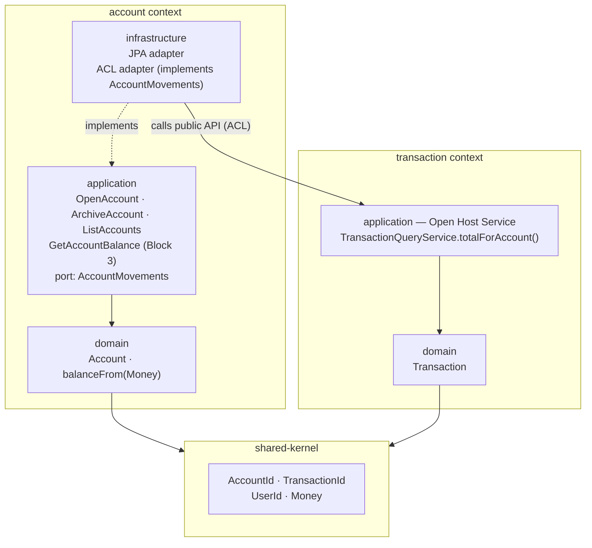
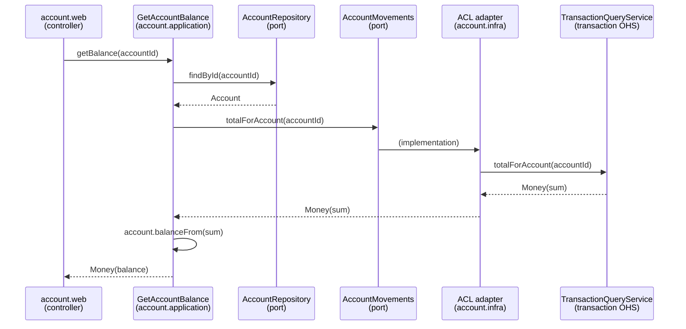

# Session Recap — 2026-06-28 — Session 19

## Objective
Design conversation (no code) to clarify, functionally and architecturally,
what the `account` bounded context will do in Block 2 — and in particular how
the account balance will be computed without coupling `account` to the
`transaction` context.

## What was done
- Walked through the **functional role** of the `account` bounded context: the
  registry of tracked accounts (bank accounts + credit cards), anchor point for
  transactions, owner of the balance. Use cases per the roadmap/domain-model:
  `OpenAccount`, `ArchiveAccount`, `ListAccounts`, `GetAccountBalance`.
- Clarified two domain rules:
  - **Why a credit card has no IBAN**: an IBAN addresses a *bank account* for
    transfers; a card is a payment instrument identified by its PAN (ISO/IEC
    7812) and repaid from a current account. In Pecunia's UBS context, UBS
    Current has an IBAN, UBS Visa does not. The invariant `CREDIT_CARD ⇒ no
    IBAN` encodes that reality (true within this bounded context, not a
    universal law).
  - **Balance is computed, not stored**: `currentBalance = initialBalance +
    Σ transactions`. Avoids drift between a stale stored balance and reality.
- Addressed the performance worry about computing the balance from a growing
  transaction list: the **domain method** takes the data as input (pure,
  testable), but the **production read path** should aggregate in SQL
  (`SELECT SUM(...)`) and return a scalar, not hydrate thousands of entities.
  At a personal scale (~20–25k rows over a decade, indexed) this is
  milliseconds. Materialized/snapshot balances (with their drift risk) are
  YAGNI for the MVP.
- Designed the **balance read port** to avoid an `account ⇄ transaction`
  dependency cycle (see decisions + diagrams below).

## Key decisions made
- **Defer `GetAccountBalance` to Block 3.** It is not part of the Block 2 exit
  criterion, and there are no transactions until Block 3. Block 2 ships
  `OpenAccount` / `ArchiveAccount` / `ListAccounts`, the pure domain method
  `balanceFrom(Money)` (already unit-testable), **no** `AccountMovements` port,
  and **no** `currentBalance` field in the OpenAPI contract (added additively,
  non-breaking, at Block 3).
- **Pass `Money` to the domain, not `List<Transaction>`.** The domain method
  becomes `Money balanceFrom(Money movements)` so the `account` domain never
  imports the `Transaction` type. The documented `computeBalance(transactions)`
  shape stays only as a convenient unit-test entry point, not the production
  path.
- **Inversion of dependency via a driven port owned by `account`.** `account`
  defines an `AccountMovements` port in *its own* vocabulary (`AccountId`,
  `Money`); the implementation lives at the boundary (an adapter). The domain
  knows only the interface.
- **Option B — clean boundary (Open Host Service + ACL).** At Block 3 the
  `account` adapter will call `transaction`'s **public query API**
  (`totalForAccount(...)`), not its tables. `transaction` stays master of its
  schema; `account`'s adapter is an Anti-Corruption Layer translating into
  `account`'s vocabulary. (Rejected Option A — direct DB `SUM` on the other
  module's table — to keep module boundaries clean and microservice extraction
  open.)
- **Shared kernel for typed identifiers** (`AccountId`, `TransactionId`,
  `UserId`, `Money`). This breaks the would-be module cycle: instead of
  `transaction → account` (for `AccountId`), both contexts depend on a neutral
  shared kernel. Chosen over "tolerate one directed arc + a permissive ArchUnit
  rule" because it makes the decoupling explicit and demonstrable.

## Concepts explained / learned
- **The real risk is a dependency cycle, not performance.** `transaction`
  already references `AccountId` (→ `transaction` depends on `account`). If
  `account` also depended on `transaction` for the balance, that is a
  bidirectional module dependency — exactly what ArchUnit's "bounded contexts
  independence" rule forbids.
- **Hexagonal inversion of dependency** lets `account` express its need
  (`totalForAccount`) in its own types while the boundary adapter is the *only*
  place that knows `transaction`. The `account` domain stays pure.
- **Open Host Service (OHS)** — an *upstream* (provider) Context Mapping
  pattern. Instead of an ad-hoc integration per consumer, the provider publishes
  an explicit, stable, documented API (an "open host") that any context can
  consume on the same terms. It decouples the public contract from the internal
  model: `transaction` may refactor its entities/table/logic as long as the
  published signature holds. Often paired with a *Published Language* (a defined
  exchange format). Here: `transaction` exposes
  `TransactionQueryService.totalForAccount(AccountId): Money` as a single,
  deliberate public entry point — it does **not** expose its `Transaction`
  entities or its table.
- **Anti-Corruption Layer (ACL)** — the mirror *downstream* (consumer) pattern.
  It prevents the provider's vocabulary/types from leaking into and "corrupting"
  the consumer's model. The ACL is a defensive translation layer: an adapter
  that **implements a port defined by the consumer** (in the consumer's
  language), calls the provider's API, and translates the result. Benefits: if
  the provider's API changes, **only the ACL changes**; and the consumer's
  domain never sees the provider's types. Here: `account` defines
  `AccountMovements.totalForAccount(AccountId): Money` in its own vocabulary; the
  ACL adapter in `account.infrastructure` calls `transaction`'s OHS and presents
  the result as a `Money` from `account`'s point of view.
- **How OHS + ACL combine** — a Customer/Supplier relationship: `transaction`
  (upstream) *publishes* an OHS, `account` (downstream) *protects itself* with an
  ACL. They are complementary but independent (an ACL can defend against an API
  with no OHS; an OHS can serve consumers with no ACL). We adopt both so each
  side keeps its own responsibility: `transaction` owns its contract, `account`
  keeps its domain pure.
- **Honest nuance** — OHS/ACL are most powerful when the two models *diverge
  strongly* (legacy/external systems). Between two in-house contexts already
  sharing a shared kernel (`AccountId`, `Money`), there is little to translate,
  so the ACL is **light**. Its real value here is (1) the inversion of
  dependency (the port belongs to `account`) and (2) being the single isolation
  point where `account` knows `transaction` (easy to police with ArchUnit). The
  full translator role would return if a real external source (a bank
  aggregator / Open Banking — post-MVP) were integrated.
- **Shared kernel**: a small shared module for cross-context typed IDs/value
  objects; both contexts depend on it, neither depends on the other's domain.

## Architecture diagrams

### Module dependencies (Block 3 target)

Key point: both domains point **down** to the shared kernel; the only
cross-context arc is `account.infrastructure → transaction (public API)`. No
domain depends on another domain → no cycle.

### `GetAccountBalance` call flow (Block 3)

## Open questions / TODOs
- **Shape of `transaction`'s Open Host Service** (signature, return type, where
  it lives in `transaction.application`) — to be designed at Block 3.
- **ArchUnit rules** must allow `account.infrastructure → transaction` public
  API while forbidding `domain → other context` and access to internals; the
  shared-kernel choice should let the rule stay strict. To be written at Block 2
  (rules) / Block 3 (cross-context arc).
- **Where exactly the shared kernel lives** (module/package layout) and what it
  contains beyond typed IDs (e.g. `Money`) — to be settled when scaffolding
  Block 2.
- **Block 2 package structure** of the `account` context (domain / application /
  web / infrastructure) — the immediate next design step, not yet done.

## Files modified or created
- `docs/session-recaps/2026-06/2026-06-28-session-19.md` — this recap (design
  session; no source code changed).

## Suggested next steps
- Design the **Block 2 package structure** for the `account` context
  (domain / application / web / infrastructure) and place `Account`, `Money`,
  the use cases and the repository port.
- Decide the **shared-kernel module layout** (where it sits in the monorepo,
  what it holds) before the first `*Id` is written.
- Slice Block 2 into small thematic PRs per the standing merge policy, starting
  with the `account` domain (author-written) + ArchUnit baseline.

## Session metadata
- Duration: ~1 hour (design/discussion session, no code)
- Model(s) used: Claude Opus 4.8
- Block / phase: Transition into Block 2 — Domain Model (account bounded
  context design).
